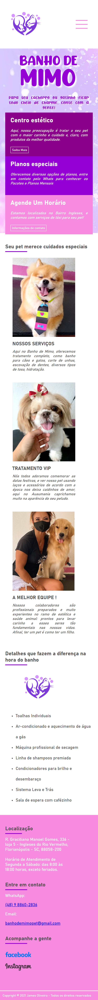

# Site para um petshop local chamado "Banho de Mimo"

> Template básico criado para testar conhecimentos de html e css, aplicado para um petshop amigo.

## Imagens

  
  
    

  

## Resumo

O objetivo era criar algo simples, apenas utilizar html e css, flexgrid, criando um template responsivo e assim desenvolvendo as habilidade adquiridas sobre essas tecnologias. 

## Versões - Histórico

* 0.2.0 Versão utilizada atualmente
    * Atualização de conteúdo
    * Links
* 0.1.0
    * Responsividade
    * Adição de conteúdo
* 0.0.1
    * Criação de Template inicial

## 

[https://github.com/JamesOliveira1](https://github.com/JamesOliveira1/)

